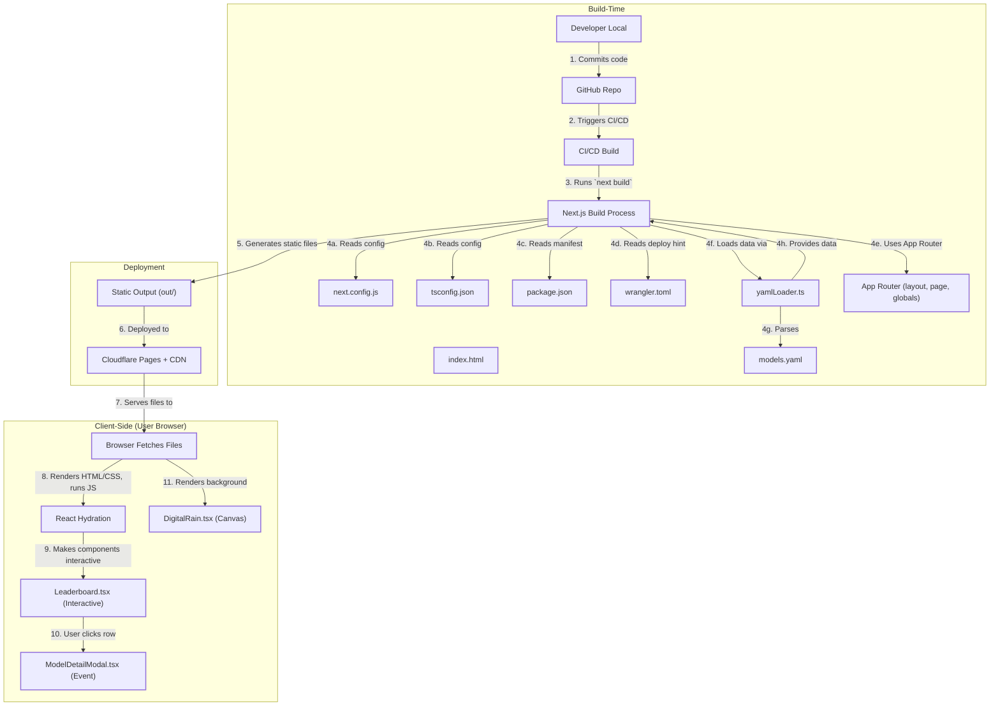

# @techfrens Coding LLM Benchmarks (aj47-techfren-leaderboard)

[](https://opensource.org/licenses/MIT)

https://github.com/aj47/aider/tree/aj-bench <- Branch for the benchmarking code to run benchmark yourself

This project presents an unofficial leaderboard for Large Language Model (LLM) coding benchmarks, specifically focusing on results from running the [Aider Polyglot Benchmarks](https://aider.chat/docs/leaderboards/).

The goal is to provide insights into the performance (pass rate), speed, and cost associated with various LLMs for coding tasks. This leaderboard includes models that may not appear on official lists, such as smaller, newer, or less common ones.

It's a community-driven effort hosted by `@techfrens` / `aj47`.

**Live Site URL:** [https://techfren.net/](https://techfren.net/) (or replace with the actual deployment URL)

## Key Features

*   **Interactive Leaderboard:** Displays LLM benchmark results in a sortable table.
*   **Core Metrics:** Ranks models based on Pass Rate, Speed per Case (lower is better), and Cost.
*   **Sorting:** Allows users to sort the leaderboard by the main metrics (Pass Rate, Speed, Cost).
*   **Language-Specific Filtering & Sorting:** Filter and sort results based on performance in specific languages (JavaScript, Python, Java, C++, Go, Rust).
*   **Detailed View:** Toggle between a simple overview and a detailed table view showing more metrics (first pass rate, date, errors, etc.).
*   **Model Details Modal:** Click on any model row to see a comprehensive breakdown of its benchmark run, including:
    *   Basic run information (command, versions, date, edit format)
    *   Detailed performance metrics (pass counts, well-formed responses)
    *   Token usage statistics (total, prompt, completion, averages)
    *   Error analysis (malformed responses, timeouts, syntax errors)
    *   Language-specific pass rates
    *   Metadata (Open Source status, Sponsor)
*   **Visual Flair:** Features a "Digital Rain" background effect for thematic styling.
*   **Community Links:** Provides easy access to the [@techfrens Discord](https://discord.gg/cK9WeQ7jPq) and the [GitHub Repository](https://github.com/aj47/techfren-leaderboard).
*   **Sponsorship:** Includes information on how to sponsor a benchmark run for a specific model.
*   **Responsive Design:** Adapts to various screen sizes.

## Technology Stack

*   **Framework:** [Next.js](https://nextjs.org/) (v14+ with App Router)
*   **Language:** [TypeScript](https://www.typescriptlang.org/)
*   **UI Library:** [React](https://reactjs.org/)
*   **Styling:** [Tailwind CSS](https://tailwindcss.com/)
*   **Data:** Benchmark results stored in [YAML](https://yaml.org/) (`src/data/models.yaml`).
*   **Data Parsing:** [js-yaml](https://github.com/nodeca/js-yaml) library.
*   **Deployment:** Configured for Static Site Generation (`output: 'export'`) and deployment via [Cloudflare Pages](https://pages.cloudflare.com/) (indicated by `wrangler.toml` and `public/_redirects`).

## GitDiagram:



## Project Structure

```text
aj47-techfren-leaderboard/
├── .npmrc                # NPM configuration (disables package-lock)
├── index.html            # (Likely unused by Next.js build) Alternative Vue.js implementation
├── LICENSE               # Project license file (MIT)
├── next-env.d.ts         # Next.js TypeScript environment definitions
├── next.config.js        # Next.js configuration (static export)
├── package.json          # Project dependencies and scripts
├── tsconfig.json         # TypeScript configuration
├── wrangler.toml         # Cloudflare Pages build configuration
├── public/               # Static assets served directly
│   ├── _redirects        # Cloudflare Pages redirect rules for SPA routing
│   └── robots.txt        # Instructions for web crawlers
└── src/                  # Main application source code
    ├── app/              # Next.js App Router directory
    │   ├── globals.css   # Global styles (Tailwind CSS)
    │   ├── layout.tsx    # Root layout component
    │   └── page.tsx      # Main page component for the leaderboard
    ├── components/       # Reusable React components
    │   ├── DigitalRain.tsx       # Canvas background effect
    │   ├── Leaderboard.tsx       # Interactive leaderboard table
    │   └── ModelDetailModal.tsx  # Modal for showing model details
    ├── data/             # Data files
    │   └── models.yaml   # LLM benchmark data
    └── utils/            # Utility functions
        └── yamlLoader.ts # Function to load and parse YAML data at build time
```

## Data Source

The benchmark data powering the leaderboard is stored in `src/data/models.yaml`. This file contains a list of models, each with its primary metrics (`passRate`, `speed`, `cost`) and a nested `details` object containing comprehensive results from the benchmark run.

The data is loaded **at build time** using the `src/utils/yamlLoader.ts` utility, which reads the YAML file using Node.js `fs` and parses it with `js-yaml`.

## Running Locally (Development)

1.  Clone the repository:
    ```bash
    git clone https://github.com/aj47/techfren-leaderboard.git
    cd techfren-leaderboard
    ```
2.  Install dependencies:
    ```bash
    npm install
    # or yarn install or pnpm install
    ```
3.  Run the development server:
    ```bash
    npm run dev
    # or yarn dev or pnpm dev
    ```
4.  Open [http://localhost:3000](http://localhost:3000) in your browser.

## Building for Production (Static Export)

To generate the static files for deployment:

```bash
npm run build
